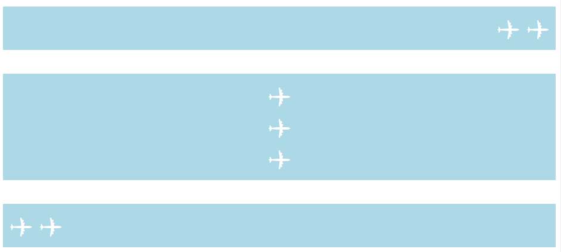

## Elemente de tip inline sau text.

> a se vedea (HTML):
[elemente de tip "inline" ](https://developer.mozilla.org/en-US/docs/Web/HTML/Inline_elements),
[constructia "for() imbricata/dubla"](https://mathbits.com/MathBits/Java/Looping/NestedFor.htm),
[constructia "if/else"](https://docs.oracle.com/javase/tutorial/java/nutsandbolts/if.html),

---

Afisarea oricarui element in document este determinata de un careva model de comportament care i se atribuie. Acest model determina modul in care
elementul se va aranja si va interactiona cu elementul parinte, elementele vecine si in raport cu ceea ce contine elementul respectiv.

Modelul elementului de tip text sau asa-numit "inline" este cel mai simplu model de comportament in document. Este atunci cand elementele se comporta
de parca ar fi cuvinte sau fraze, sau linii dintr-un fragment de text.

Elementele care au asa un comportament tipic sunt ```<strong>,<b>,<em>,<i>,<span>,<a>``` si continutul de tip textual al oricarui element. Mai exista unele elemente care se comporta partial ca fiind elemente textuale, spre exemplu ``````.

Cand operati cu aceste elemente trebuie va imaginati ca aveti de a face cu text. Respectiv retineti urmatoarele idei:
* Pentru un aranjament grosolan in directie orizontala (de-a lungul liniei textului) se poate utiliza proprietatea CSS ```text-align``` cu una din valorile ```left,center,right,justify```.
* Pentru a aranja mai exact elementele intre ele (a le distanta) in directie orizontala, puteti utiliza proprietatea ```margin-left,margin-right``` cu valori in unitati de lungime (de ex "px") ceea ce va va permite sa le aranjati cu o precizie mai mare
* Pentru a delimita mai bine spatiul intern (continutul) elementului in directie orizontala, cu o precizie destul de mare, puteti utiliza ```padding-left,padding-right``` cu valori in unitati de lungime (de ex. "px")
* In directie verticala elementele de tip text se gestioneaza datorita proprietatilor care modifica: ```line-height``` - inaltimea randului, ```font-size``` - inaltimea literelor.


Sa ne imaginam ca urmatorul document descrie amplasarea avianelor la un moment de timp intr-un aeroport cu 7 piste de decolare. Fiecare pista este delimitata de un ```<p>```. Iar avianele aflate pe aceste piste sunt delimitate de elementul de tip inline ```<span>```. Incercati sa rezolvati urmatoarele probleme de aranjare.

### 1. Un aeroport mic.
Luand drept baza urmatorul cod.
``` text-align ```  aranjati elementele ca in desen.

```html
<!DOCTYPE html>
<html lang="en">
<head>
  <meta charset="UTF-8">
  <meta name="viewport" content="width=device-width, initial-scale=1.0">
  <meta http-equiv="X-UA-Compatible" content="ie=edge">
  <title>Inline Elements Example - Airport</title>
  <style>
    p{
      padding:          10px;
      background-color: lightblue;
      font-size:        40px;
      color:            white;
    }
  </style>
</head>
<body>

  <p>
    <span>&#9992;</span>
    <span>&#9992;</span>
  </p>
  <p>
    <span>&#9992;</span><br>
    <span>&#9992;</span><br>
    <span>&#9992;</span>
  </p>
  <p>
    <span>&#9992;</span>
    <span>&#9992;</span>
  </p>


</body>
</html>

```


Sa se efectuieze urmatoarele:
  * Utilizand doar proprietatea ***text-align*** si selectarea elementelor prin identificator, adresati-va fiecarei piste in parte si aplicati-le stiluri astfel incat rezultatul sa fie asemantor celui din imagine.

  

  * Combinand proprietatile ***text-align*** si ***margin-left,margin-right***, aplicati stiluri adresandu-va prin identificator pistelor si prin clase - avianelor, astfel incat rezultatul sa fie ca si cel prezentat in imaginea de mai jos.

  

  * BONUS: aplicand proprietatea ***font-size*** si ***color*** adresati-va cu ajutorul unui selector compus catre avionul al 4-lea numarand de sus, astfel incat acesta sa fie colorat in verde si sa creasca ca marime de doua ori.

---
