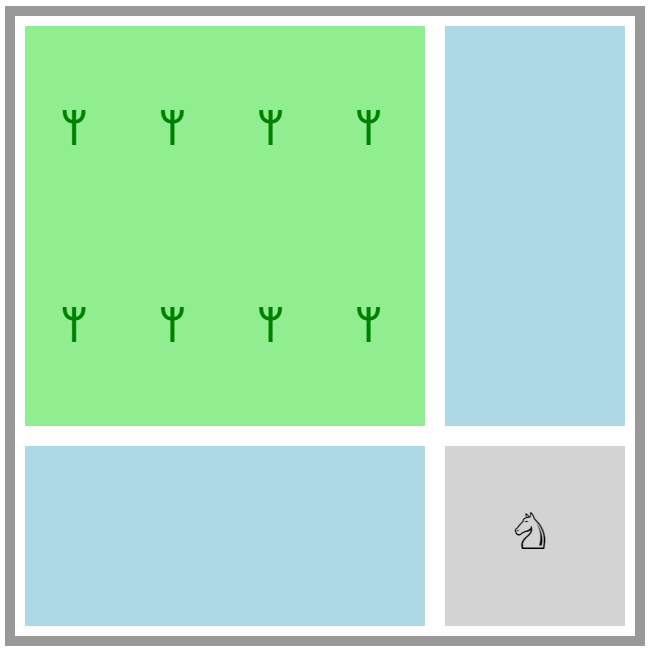
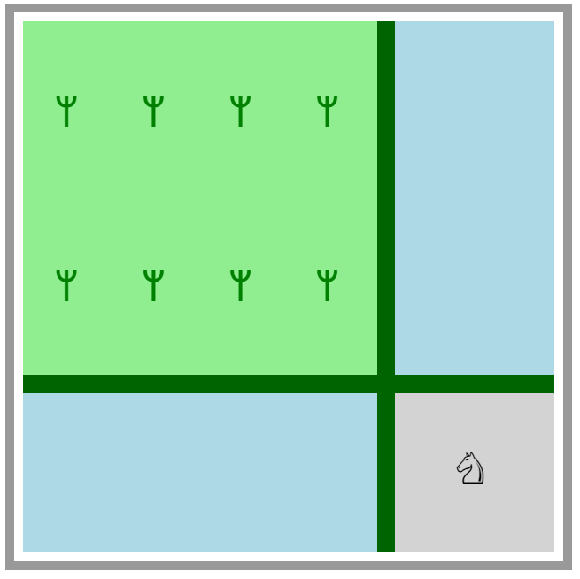

## Elemente de tip block sau boxa.

> a se vedea (HTML):
[elemente de tip "block" ](https://developer.mozilla.org/ro/docs/Web/HTML/Block-level_elements#Block-level_vs._inline),
[modelul de aranjare vizuala](https://html5book.ru/block-inline-elements/#part1),


---

Afisarea oricarui element in document este determinata de un careva model de comportament care i se atribuie. Acest model determina modul in care
elementul se va aranja si va interactiona cu elementul parinte, elementele vecine si in raport cu ceea ce contine elementul respectiv.

Modelul de tip block sau boxa de afisare a elementelor este caracterizat prin faptul ca acestea de obicei incep din rand nou si au tendinta sa ocupe tot spatiul disponibil in directie orizontala. Prin urmare un element de tip block va avea din start inaltimea determinata de continutul pe care il are acesta, iar latimea acestuia va fi expandata pe tot spatiul dispobinil oferit de continutul elementului parinte.

Un lucru important de mentionat aici este faptul ca atat timp cat dimensiunile elementului de tip block nu sunt specificate, latimea acestuia se va calcula din spatiul oferit scazand valorile spatiului extern, al chenarului si al spatiului intern.


Elementele care au asa un comportament tipic sunt ```<h1>-<h6>,<p>,<div>,<ul>,<li>,<header>,<section>,...```.

Cand operati cu aceste elemente trebuie va imaginati ca aveti de a face cu o cutine/boxa sau cu o sectiune a paginii. Respectiv retineti urmatoarele idei:
* Pentru a da dimensiune continutului unui block pot fi utilizate proprietatile ```width``` si ```height``` indicate in unitati de masura a lungimii. Din start valoarea acestora este in regim de calcul automat ```auto```.
* Pentru a dirija cu spatiul intern in orice directie (campul din interior) puteti utiliza proprietatea ```padding``` cu oricare din cele 4 directii de baza ```top,right,bottom,left```.
* Pentru a distanta elementele de tip block intre ele sau intre ele si elementele vecine, sau de la chenarul elementului parinte, puteti utiliza spatiul exterior ```margin``` combinand-ul cu aceleasi 4 directii de baza ca si pentru ```padding```.
* Atentie! valoarea ```margin``` in directie verticala din start se va suprapune cu ```margin``` pentru aceiasi directie a elementului parinte sau a vecinului in directia respectiva si va predomina acea valoare care este mai mare.


Sa ne imaginam ca urmatorul document descrie amplasarea cladirilor aflate intr-un cartie cu parc si o piata cu monument. Pornind de la exemplu de mai jos faceti in asa mod incat rezultatul sa corespunda imaginii.

### 1. Un cartier mic.
Luand drept baza urmatorul cod.

```html
<!DOCTYPE html>
<html lang="en">
<head>
  <meta charset="UTF-8">
  <meta name="viewport" content="width=device-width, initial-scale=1.0">
  <meta http-equiv="X-UA-Compatible" content="ie=edge">
  <title>Inline Elements Example - Airport</title>
  <style>
    #square{
      width: 600px;
      height: 600px;
      border: 10px solid #999;
      padding: 10px;
    }
    #park{
      width: 400px;
      height: 400px;
      background-color: lightgreen;
      /* ??? */
    }
    #building-1{
      width: 180px;
      height: 400px;
      background-color: lightblue;
      /* ??? */
    }
    #building-2{
      width: 400px;
      height: 180px;
      background-color: lightblue;
      /* ??? */
    }
    #market{
      background-color: lightgrey;
      /*  ???  */
    }
    #market .monument{
      font-size: 50px;
      /* ??? */
    }
    #park .tree{
      font-size: 50px;
      color: green;
      /* ??? */
    }

  </style>
</head>
<body>

  <section id="square">

    <div id="park">
      <div class="tree">&#5848;</div>
      <div class="tree">&#5848;</div>
      <div class="tree">&#5848;</div>
      <div class="tree">&#5848;</div>
      <div class="tree">&#5848;</div>
      <div class="tree">&#5848;</div>
      <div class="tree">&#5848;</div>
      <div class="tree">&#5848;</div>
    </div>
    <div id="building-1"></div>
    <div id="building-2"></div>
    <div id="market">
      <div class="monument">
        &#9816;
      </div>
    </div>

  </section>


</body>
</html>


```


Sa se efectuieze urmatoarele:
  * Utilizand ***margin*** in combinatie cu ***padding*** si ***float*** sa se realizeze urmatorul rezultat.

  


  * BONUS: incercati sa aplicati proprietatea ***border*** in anumite locuri astfel incat rezultatul sa se schimbe in urmatorul mod prezentat mai jos.

  

---
