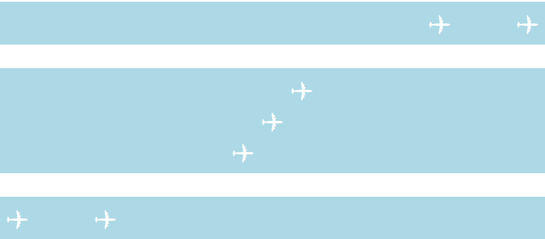

## Строчные или текстовые элементы (inline, text).

> изучить (HTML):
[строчные элементы "inline" ](https://developer.mozilla.org/en-US/docs/Web/HTML/Inline_elements),

---

Отображение любого элемента в документе определяется присущим ему шаблоном поведения. Эта модель определяет, как
элемент будет себя вести и взаимодействовать с родительским элементом, соседними элементами и своим содержимым.

Модель строчных/текстовых элементов или так называемых "inline" элементов - это самый простой шаблон поведения в документе. Такие элементы ведут себя подобно словам, фразам или строкам в тексте.

Элементами, которым присуща данная модель поведения являются ```<strong>, <b>, <em>, <i>, <span>, <a>```, а также текстовое содержимое любого элемента. Есть некоторые элементы, которые ведут себя частично как строчные элементы, например ``````.

При работе с подобными элементами следует представлять, что Вы имеете дело с текстом. Также следует понимать такие моменты, как:
* Для выравнивания по горизонтали (вдоль строки текста) вы можете использовать свойство CSS ```text-align``` с одним из значений ```left, center, right, justify```.
* Для выравнивания элементов относительно друг друга по горизонтали (добавления внешнего отступа), можно применить свойства ```margin-left, margin-right``` со значениями в единицах длины (например, "px"), что позволит распределять/выравнивать их с большей точностью
* Чтобы лучше и более точно распределить внутреннее пространство элемента (вокруг содержимого) по горизонтали, вы можете использовать свойства ```padding-left, padding-right``` со значениями в единицах длины (например, "px" )
* По вертикали строчные элементы выравниваются свойствами, которые изменяют: ```line-height``` - высоту строки, ```font-size``` - высоту шрифта/букв.

Представим, что приведенный ниже документ описывает расположение самолетов, находящихся одновременно в аэропорту с 7 взлетными полосами. Полосы созданы при помощи ```<p>```. А самолеты, расположенные на полосах, созданы при помощи строчного элемента ```<span>```. Постарайтесь устранить следующие проблемы выравнивания.

### 1. Небольшой аэропорт.
Берем за основу следующий код.
``` text-align ```  расположите элементы как показано на рисунке.

```html
<!DOCTYPE html>
<html lang="en">
<head>
  <meta charset="UTF-8">
  <meta name="viewport" content="width=device-width, initial-scale=1.0">
  <meta http-equiv="X-UA-Compatible" content="ie=edge">
  <title>Inline Elements Example - Airport</title>
  <style>
    p{
      padding:          10px;
      background-color: lightblue;
      font-size:        40px;
      color:            white;
    }
  </style>
</head>
<body>

  <p>
    <span>&#9992;</span>
    <span>&#9992;</span>
  </p>
  <p>
    <span>&#9992;</span><br>
    <span>&#9992;</span><br>
    <span>&#9992;</span>
  </p>
  <p>
    <span>&#9992;</span>
    <span>&#9992;</span>
  </p>


</body>
</html>

```

Выполните следующие задания:
  * Применяя только свойство ***text-align*** и выбирая элементы по идентификатору, обратитесь к каждой взлетной полосе и примените стили таким образом, чтобы результат был как на картинке.


  * Применяя совместно свойства ***text-align*** и ***margin-left, margin-right***, поменяйте стили, обращаясь к взлетным полосам по идентификатору, а к самолетам по классам, таким образом, чтобы результат был как на картинке ниже.



* БОНУС: применяя свойство ***font-size*** и ***color*** обратитесть к 4-му сверху самолету при помощи комбинированного селектора и поменяйте стили таким образом, чтобы он окрасился в зеленый цвет и увеличился в два раза.

---
