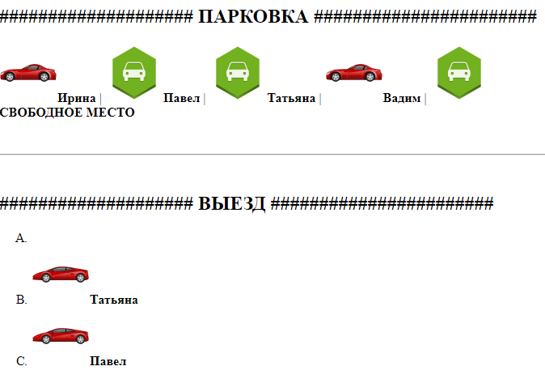

## Списки и их элементы. Форматирование текста.

> изучить (HTML):
[элементы "img"](http://htmlbook.ru/html/img),
[элементы "ul"](http://htmlbook.ru/html/ul),


---

ПРИМЕЧАНИЕ. Браузеры обычно отображают все типы списков, располагая элементы по вертикали! Так стилизуются списки по умолчанию.

### 1.Parking List.

Предположим, что следующая страница - это автостоянка с 5-ю парковочными местами и 3-мя выездами (A, B, C).

```html
<!DOCTYPE html>
<html>
<head>
  <meta charset="UTF-8">
  <title>Parking List</title>
</head>
<body>
  <h2>#################### ПАРКОВКА #######################</h2>
  <p><b>Ирина</b> | <b>Павел</b> | <b>Татьяна</b> | <b>Вадим</b> | <b>СВОБОДНОЕ МЕСТО</b></p>

  <br>
  <hr>
  <br>
  <h2>#################### ВЫЕЗД #######################</h2>
  <ol type="A">
    <li></li>
    <li></li>
    <li></li>
  </ol>
</body>
</html>


```

ПРИМЕЧАНИЕ. Для успешной работы с этим примером, мы рекомендуем создать папку (например, "parking"), внутри которой создать файл «cars.html» и сохранить изображения в эту же папку!  si , 
Таким образом, в итоге вы получите следующую структуру
* parking/
  - cars.html
  - car-1.png
  - car-2.png
  - car-park-place.png


Далее, необходимо выполнить следующее:
* Измените код HTML таким образом, чтобы показать, что ***Татьяна*** и ***Павел*** покинули свои парковочные места.
* Изобразите ситуацию, когда ***Татьяна*** находится у выезда "B", а ***Павел*** у выезда "C".

Результат должен выглядеть, как показано на изображении



---

ПРИМЕЧАНИЕ: в примере использовались изображения с сайта:
[http://www.iconarchive.com/](http://www.iconarchive.com/)
---
