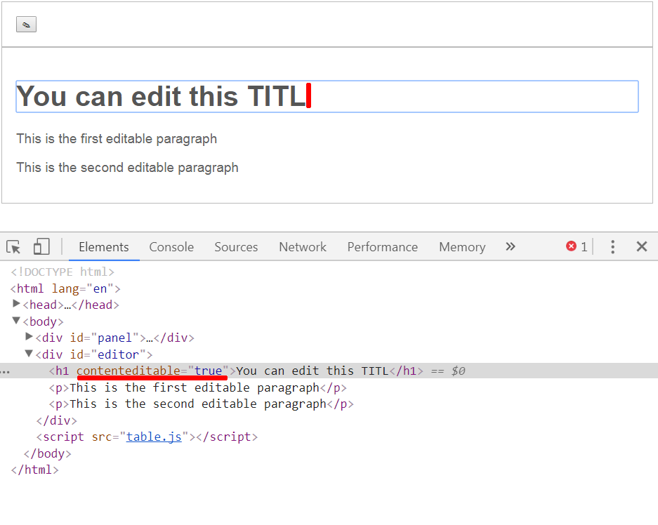

## Визуальные компоненты для бэкэнда
> изучить (js):
[метод "getElementById()"](https://www.w3schools.com/jsref/met_document_getelementbyid.asp),
[свойства элементов "contenteditable", "lastElementChild"](https://www.w3schools.com/tags/att_global_contenteditable.asp),
[атрибут "children"](https://www.w3schools.com/jsref/prop_element_children.asp),

---

Существует визуальный компонент, который часто встречается на панелях администрирования некоторых сайтов и который позволяет редактировать опубликованные на сайте материалы. Этот компонент называется редактор "wysiwyg" или визуальный редактор. Выше перечислены несколько полезных ссылок, которые ознакомят вас с этим редактором.
В современных редакторах существует интересная возможность так называемого "inline" редактирования или "in place editing (IPE)", что означает, что текст, подлежащий редактированию, представлен в готовом виде - со стилями и всеми взаимодействиями, и если необходимо внести изменения достачно нажать на кнопку, которая активирует данную опцию. Начиная с HTML5 данная технология IPE стала более доступной и простой в реализации, так как она позволяет прямое редактирование непосредственно в элементе - то есть H1, или P или практически любом другом элементе благодаря атрибуту "contenteditable".

Представьте, что элементы, находящиеся внутри редактора #editor становятся доступными для редактирования, если им добавить атрибут «contenteditable». На базе приведенного ниже кода необходимо, чтобы при нажатии на кнопку #btn-edit инициировался режим редактирования для элементов H1 и P в #editor.

Ниже исходный код

### editor.html

```html

<!DOCTYPE html>
<html lang="en">
<head>
  <meta charset="UTF-8">
  <meta name="viewport" content="width=device-width, initial-scale=1.0">
  <link rel="stylesheet" href="editor.css">
  <title>Example of an IPE</title>
</head>
<body>

  <div id="panel">
    <button id="btn-edit">&#9998;</button>
  </div>
  <div id="editor">
    <h1>You can edit this TITLE</h1>
    <p>This is the first editable paragraph</p>
    <p>This is the second editable paragraph</p>
  </div>

  <script src="editor.js"></script>
</body>
</html>


```

### editor.css

```css
#panel,
#editor{
  border: 1px solid #bbb;
  padding: 20px;
  font-family: Arial, sans-serif;
}

#editor h1{
  font-size: 40px;
  color: #555;
}

#editor p{
  font-size: 19px;
  color: #666;
}


```

### editor.js

```javascript

   function turnEditOn(){
     // возможный алгоритм функции:
     // 1) найти элемент #editor
     // 2) при помощи for обратиться ко всем дочерним элементам
     // 3) всем дочерним элементам добавить атрибут "contenteditable" со значением true
   }
   function turnEditOff(){
     // точно такой же алгоритм, как и в предыдущей функции только в п. 3) - значение атрибута "contenteditable" указать как false
   }


```
функция ***turnEditOn()*** вызывается при первом клике на кнопку редактирования, при этом начинается поиск, а затем запуск режима редактирования для всех элементов в #editor.

Как проверить функционирует ли режим редактирования? - легко, после добавления атрибута "contenteditable" в браузере кликни на соответствующий элемент,
должен появиться текстовый курсор, который даст возможность изменять его содержимое.



* БОНУС: Добавьте функцию **turnEditOff()** которая отключаетт режим редактирования.
* БОНУС: Меняйте стиль кнопки таким образом, чтобы было понятно в каком случае режим редактирования включен, а в каком отключен. 

---
